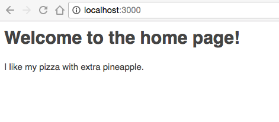
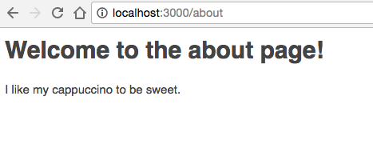
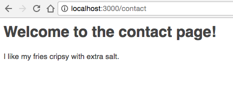
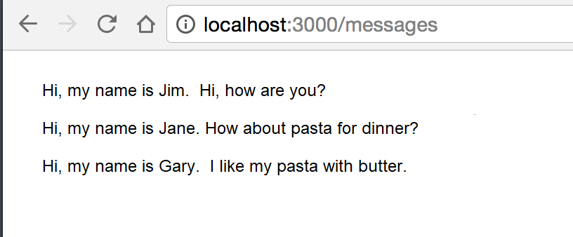

<center>

### AUSTIN COMMUNITY COLLEGE 
#### Web Software Bootcamp 
###### January 2019 - August 2019

</center>

## Project: Beginning EJS


EJS stands for embedded JavaScript. We use it for templating, and it will make our web applications more dynamic. No more static web pages!


#### Task #1: 

We will see how we can render EJS files with express.js.


Your task: 
* create a blank folder. 
* Create an app.js file. 
* Run npm init and install express.js. 
* Also install the EJS module with “npm install ejs --save”. Create a ‘views’ folder in your application. Express will automatically look for your templates in here.


Now, here is your challenge. Create three pages with EJS, one called `home`, another called `about`, and another called `contact`. Create three routes: `localhost:3000/` should take you to the home page, `localhost:3000/about` should take you to the about page, and `localhost:3000/contact` should take you to the contact page.


On the home page, create an h1 that says “Welcome to the home page!” On the about page, create an h1 that says “Welcome to the about page!” On the home page, create an h1 that says “Welcome to the contact page!”


Here’s the next part of your challenge: passing variables from your app.js file to your template pages.


In app.js, create three variables: one variable called ‘pizza’ that contains the string ‘I like my pizza with extra pineapple.’, another variable called ‘cappuccino’ that contains the string ‘I like my cappuccino to be sweet.’, and another variable called ‘fries’ that contains the string ‘I like my fries crispy with extra salt.’


Now using EJS tags, you must render the contents of these variables onto the home, about, and contact page. The home page should render the `pizza` variable, the about page should render the `cappuccino` variable, and the contact page should render the `fries` variable. It should look like the following:

  1. 
  1. 
  1. 

Hint: you will still be using Express’s render method to load up these EJS templates. 


In order to send variables to other pages, you have send a JavaScript object as an argument to the render method.


#### Task #2:
 
1. Once again, create a blank folder. Create an `app.js` file. Run `npm init` and install express.js. Also install the EJS module with `npm install ejs --save`. Create a ‘views’ folder in your application. In the views folder, create a file called `messages.ejs`.


2. In your app.js file, create an array of objects that looks like this: 

```
 var messages = [
   {name: "Jim", message: "I'm a cartoonist"},
   {name: "Jane", message: "How about pasta for dinner?"},
   {name: "Gary", message: "I like my pasta with butter"}
 ]
```

3. This is an array of objects. Each object has keys called name and message.


4. Your challenge is to take this array and make it display as such when you go to localhost:3000/messages:

    

    Hint: you will need to use a loop.


#### Task #3:

We will be working with partials for this task.

You will need to create three web pages that look like this:

  1. 
  1. 
  1. 


You must:

  1. Go through the steps of creating a new application with express.js and EJS installed 
  2. Have a `views` folder and a `partials` folder
  3. The partials folder should contain two files: `header.ejs` and `footer.ejs`
  4. The `header.ejs` file should contain the top part of your HTML code, including the nav bar
  5. The footer.ejs’ file should contain the bottom part of your HTML code, including the footer links
  6. You will also have three other files: `home.ejs`, `about.ejs`, and `contact.ejs`.
  7. Use bootstrap for styling. Use the jumbotron and breadcrumb classes for creating the body and footer.
