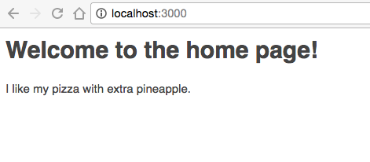
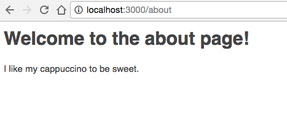
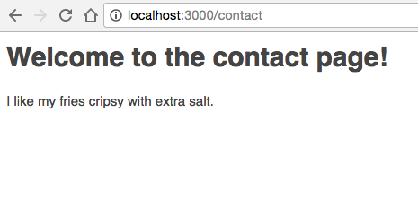
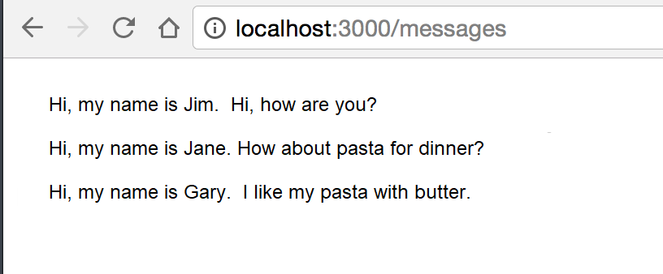
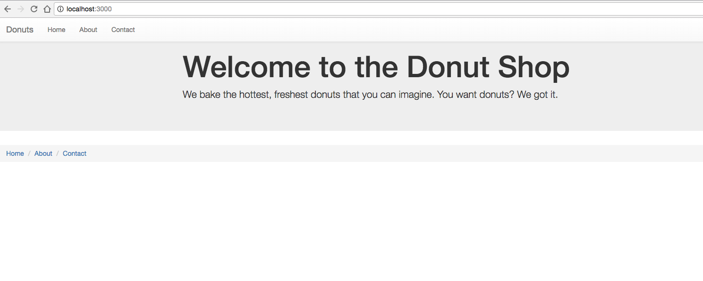
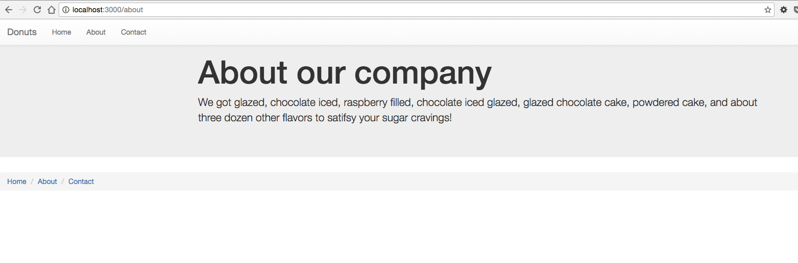
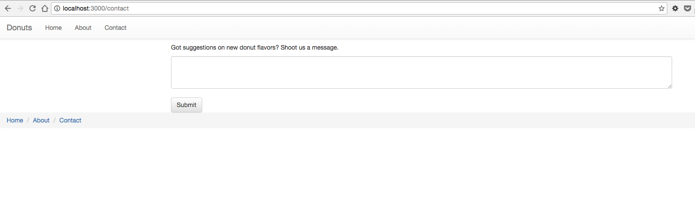

<center>

### AUSTIN COMMUNITY COLLEGE 
#### Web Software Bootcamp 
##### January 2019 - August 2019

</center>

### LEARNING GOALS

This week we will be learning about Node.js and a templating library called EJS. EJS stands for embedded JavaScript. We use it for templating, and it will make our web applications more dynamic. No more static web pages!  With EJS, JavaScript code is embedded in an HTML document.  The node server converts the JS into HTML markup and sends the generated HTML (renders) to the client browsers.  

### PROJECTS  

#### Project #1: 

We will see how we can render EJS files with express.js.

##### Setup Steps:

1. Create a blank folder.

1. Create an `app.js` file.

1. Run `npm init` and install `express.js`.

1. Also install the EJS module with `npm i ejs --save`. 

1. Create a `views` folder in your application. Express will automatically look for your templates in there.

##### Project Tasks

1. Create three pages with EJS
    * home, with route `localhost:3000/`
    * about, with route `localhost:3000/about`
    * contact, with route `localhost:3000/contact`

1. Create headings as follows
    * On the home page, create an `h1` that says “Welcome to the home page!” 
    * On the about page, create an h1 that says “Welcome to the about page!” 
    * On the home page, create an h1 that says “Welcome to the contact page!”

1. Next we will be passing variables from your `app.js` file to your rendered template pages.  In app.js, create three variables: 
    * one variable called ‘pizza’ that contains the string ‘I like my pizza with extra pineapple.’, 
    * one variable called ‘cappuccino’ that contains the string ‘I like my cappuccino to be sweet.’, and 
    * another variable called ‘fries’ that contains the string ‘I like my fries crispy with extra salt.’

1. Now using EJS tags, you must render the contents of these variables onto the home, about, and contact page. 
    * The home page should render the pizza variable, 
    * The about page should render the ‘cappuccino’ variable, and 
    * The contact page should render the fries variable. It should look like the following:


      
      
      

    You will still be using Express’s render method to load up these EJS templates. 

    In order to send variables to other pages, you have send a JavaScript object as an argument to the render method.


#### Project #2:
 
1. Once again, create a blank folder. Create an app.js file. Run npm init and install express.js. Also install the EJS module with “npm install ejs --save”. Create a ‘views’ folder in your application. In the views folder, create a file called messages.ejs.

1. In your app.js file, create an array of objects that looks like this: 

    ```
    var messages = [
       {name: "Jim", message: "I'm a cartoonist"},
       {name: "Jane", message: "How about pasta for dinner?"},
       {name: "Gary", message: "I like my pasta with butter"}
    ]
    ```

1. This is an array of objects. Each object has keys called name and message.

1. Your challenge is to take this array and make it display as such when you go to localhost:3000/messages:

    

    Hint: you will need to use a loop.


#### Project #3:

We will be working with partials for this task.  You will need to create three web pages that look like this:

   

   
  
   

Steps:

  1. Go through the steps of creating a new application with express.js and EJS installed 
  1. Have a `views` folder and a `partials` folder
  1. The partials folder should contain two files: `header.ejs` and `footer.ejs`
  1. The `header.ejs` file should contain the top part of your HTML code, including the nav bar
  1. The footer.ejs’ file should contain the bottom part of your HTML code, including the footer links
  1. You will also have three other files: `home.ejs`, `about.ejs`, and `contact.ejs`.
  1. Use bootstrap for styling. Use the jumbotron and breadcrumb classes for creating the body and footer.
