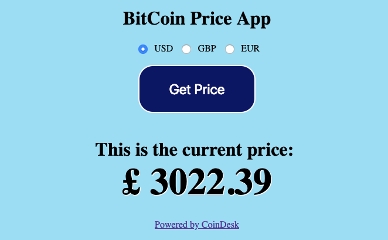
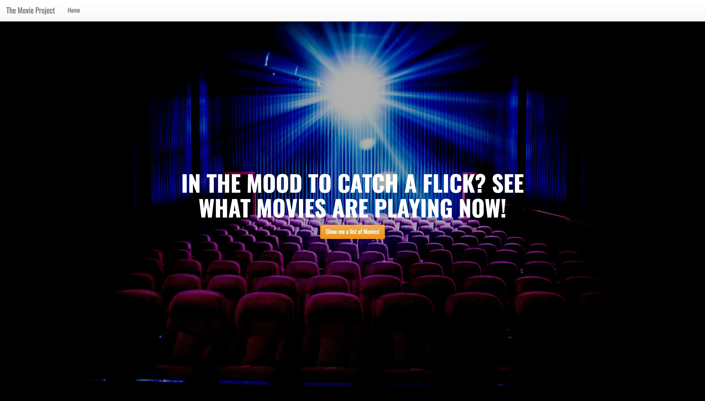
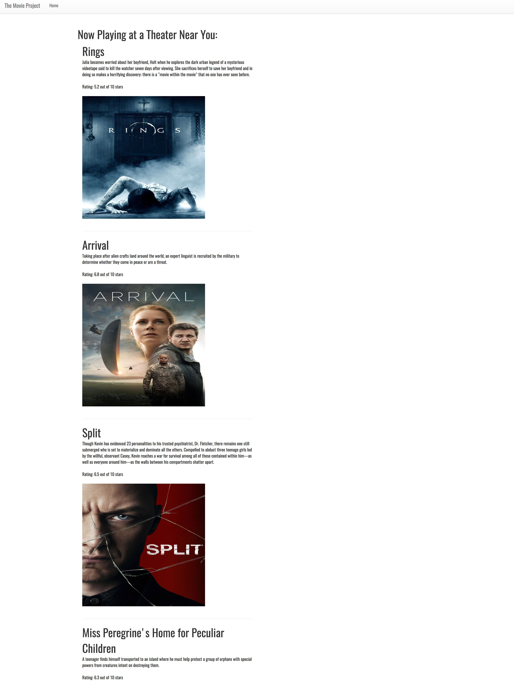

### AUSTIN COMMUNITY COLLEGE 
#### Web Software Bootcamp 
##### January 2019 - August 2019

# LEARNING GOALS

  Welcome to APIs! APIs are an important subject and many companies will ask if you know how to use them, so please pay careful attention to the materials this week. You will be using everything that you’ve learned up until this point (HTML, CSS/Bootstrap, JS/Node/Express, EJS, etc.)  
  
  With APIs, we can now draw data from external resources, e.g. weather data, restaurant reviews, twitter feeds, youtube videos, github repositories and users, names of your congresspersons and senators, currency conversion etc.  In this project, we will be building our own restaurant finding application. When a user enters their city, they would get a list of restaurants near their specified location.

### Self Learning

[JSON and AJAX Tutorial: Youtube](https://www.youtube.com/watch?v=rJesac0_Ftw)

[Asynchronous JavaScript Tutorial: Youtube](https://www.youtube.com/playlist?list=PL4cUxeGkcC9jAhrjtZ9U93UMIhnCc44MH)  Please try and go over the first 4 videos in this series as they would be very helpful in the upcoming projects and in your overall understanding of the asynchoronous nature of JS.

#  PROJECTS

#### Project 1: Food Finder

1. We will be using the public API from Yelp. In order to use it, you’ll need to create an account on Yelp. From the developers page, you’ll need to retrieve your client ID, and API key: https://www.yelp.com/developers/v3/manage_app

1. You will also be using the Yelp nodejs module. This module will make it easier for us to make requests. https://www.npmjs.com/package/yelp-fusion

1. You will also need EJS and Express.

1. You should also look at the Yelp documentation, especially on the search parameters when making requests: https://www.yelp.com/developers/documentation/v3/get_started

1. Create two main pages: 
  - home.ejs page, and 
  - searchresults.ejs page.

1. The home.ejs page has a form that allows a user to enter a city. When they hit the submit button, it should take them to the searchresults.ejs page where the a list of restaurants is displayed.

1. The searchresults.ejs page should display upto 10 search results. They should be linked to their respective Yelp page, and an image of their rating should be next to each link.

1. Use bootstrap for styling.

1. Use partials to hold your boilerplate header and footer HTML code.

1. This project will exercise your ability to drill down on an object. If you need help, ask!!

Screenshots of the project:
* [Home page](./images/home.png)
* [Results page](./images/results.png)

#### Project 2: Bitcoin Price Checker App

In this project, you are going to build an app that retrieves the current price of Bitcoin and displays it in the browser, when the user clicks a button.

In order to complete this exercise, you will require the following API documentation:

https://www.coindesk.com/api

Check it out and get familiar with how to use it.

Your finished app page, should look something like this

<strong>Hints:</strong>

These might help you build the above app:

1. HTML Forms: learn how to use the a form and a input of type submit.

1. How exactly does the GET method work?

1. What is difference between req.params and req.query?  What would you use in this app?

1. HTML entities

1. You may need and use [number methods](https://www.w3schools.com/js/js_number_methods.asp)

#### Project 3 (Extra): Movies Playing Now

This project is designed to test your knowledge of the front end as well as the back end. You will be building an application that allows users to find current movies playing in the theaters. 

The home page should look like this: 

When they click on the button, they are taken to a page that looks like this (note that the movies listed may be different from you have): 

When the user clicks on the button on the home page, they are taken to another page which lists four things: the movie title, overview, rating, and poster image.

You will be using the The Movie Database API. Its documentation can be found here: [API Docs](https://developers.themoviedb.org/3). 

Please note that a user key is required to read the data. It is free to sign up. Read the instructions on how to use the API.

Remember, you want to list the movies that are ‘now playing’ in theaters.
