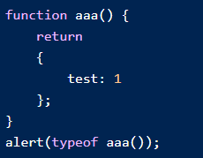

What would be the output of the following code snippet.  Why?  Correct the code if possible.

### Solution here please ...

    Returned `undefined`

    Javascript automatically puts a semi-colon after each complete statement.  Here line #2 `return` is a complete statement.  As such it is executed, ignoring the rest of the code. 

    Fix: 

    Move the `{` in line #3 to the end of the return statement.

    Examples:

#### Current code

    <pre>
    function aaa() {
        return        // here JS parser thinks it is done and hence runs
                    // return ; so here it will alert "undefined"
        { 
            test: 1
        };
    }
    alert(typeof aaa());
    </pre>

#### Changed code

    <pre>
    function aaa() {
        return {        // here JS parser thinks more is to come
            test: 1
        };
    }
    alert(typeof aaa()); // here it will say "object"
    </pre>
