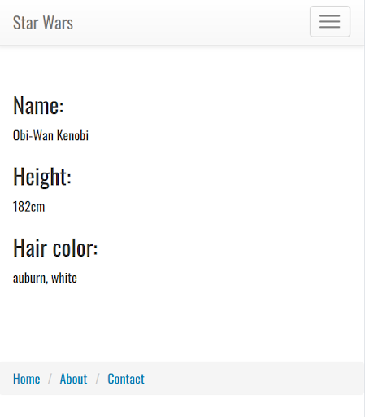
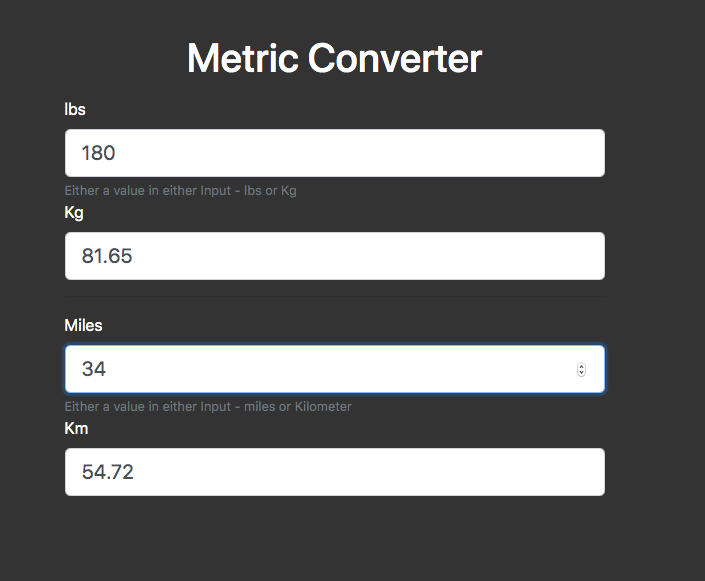

# Final Exam Project

In this section you have 2 choices.  **Do one of these, not both.**  

Once you are done, push it to your ACCSoftwareBootcamp personal repository on github.com.

# Choice 1:

This project is designed to test your knowledge of the front end as well as the back end. You will be building an application that allows users to find information about Star Wars characters. 

The home page should look like this: 

When they click on Submit, they are taken to a page that should display the name, height, and hair color of that character. (Limit your search results to just the first 10 movie characters, ie. https://swapi.co/api/people/1 to https://swapi.co/api/people/10)

You will be using the The Starwars Database API.  https://swapi.co/
Read over the documentation and familiarize yourself with how to use it.  You may use one of the wrapper modules if you choose.

# Choice 2:

This project is comprised of the following user stories:

### User Stories

1. As a website visitor, I should be able to convert from miles to kilometers and pounds to kilograms.  The site should show me the converted values in real time.

1. Converted values should be placed in an editable box, so user should be able to convert to or from miles and pounds.

### Sample UI

You may develop the UI to look something like this, using Bootstrap, vanilla CSS or any other tool of your choice. You may style it as per your preference. Credit given for functional, well documented code. The values shown below are test values only.

